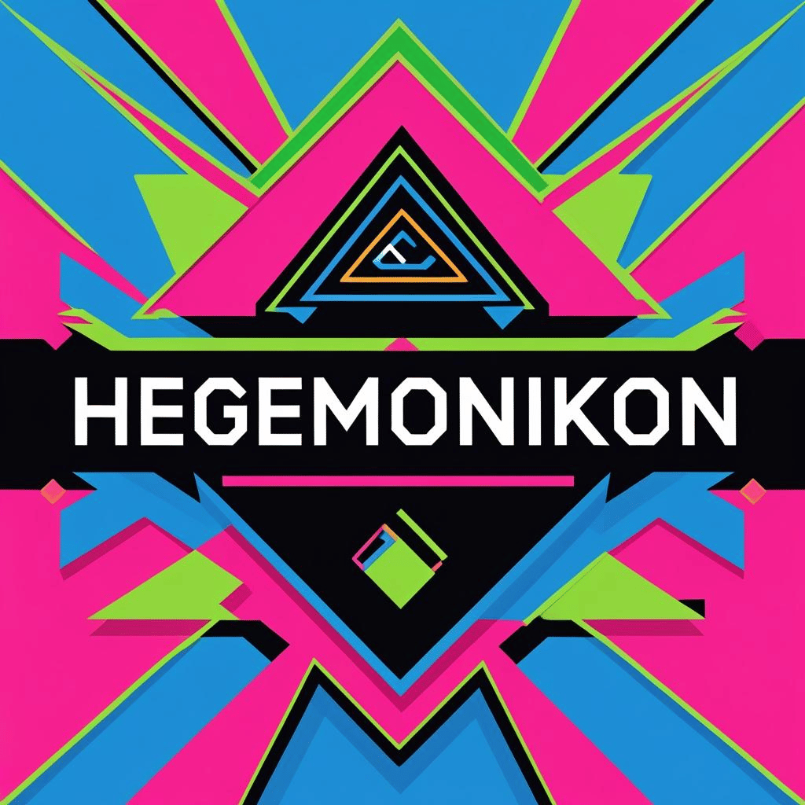

# Hegemonikon

My personal homelab.

## Why Hegemonikon?

The name comes from the Stoic concept of the *hegemonikon*—the "commanding faculty" that directs thought and action.  
This lab is my personal sandbox for exploring OS design, Kubernetes architectures, and automation with a philosophy-driven approach:

- **Purpose over generality:** Every component is built for a specific role.
- **Simplicity over complexity:** No unnecessary moving parts.
- **Learning by doing:** This is as much about the process as the result.

## Hardware

| Device | Role in Lab | CPU | GPU | Memory | Storage |
| ------ | ----------- | --- | --- | ------ | ------- |
| HP ProDesk 600 G4 Mini | Control Plane & Worker | Core i5-8500T (8th Gen) 2.1 GHz | Intel UHD Graphics 630 | 16 GB | 256 GB SSD |
| Mac Mini | iCloud Supporing Services | M2 | M2 | 8G | 256 GB SSD |
| Raspberry Pi 4 | Doorbell relay | ARM Cortex-A72 | Whatever comes in the Pi | 8G | SD Card |

## Platform Infrastructure

Still in its early stages—so far I’ve locked in the **host OS**, **Kubernetes distro**, and **one supporting service**. Expect this to evolve as I learn and expand the lab.

You can read more about my choices in [Why I Chose This Stack for My K8s Cluster](https://www.mauromorales.com/2025/08/11/why-i-chose-this-stack-for-my-k8s-cluster/).

### Host OS

**Philosophy:** I'm building a **Special-Purpose OS (SPOS)** for each node. No generic images that need post-install tweaking. Each OS:

- **Has a specific role** baked in from the start using cloud-init–like configuration.
- **Is immutable by design**—updates come from rebuilt images, not live config changes.
- **Self-configures at first boot** with everything it needs.

I use [Kairos](https://kairos.io) to accomplish all these features.

**Build process:**  

It starts with a shared Ubuntu 24.04 base image, with a few extra packages added on top of the upstream version and Kairos' own version.

Kairos Factory produces two artifacts per build:  

- **Container images** (for upgrades)  
- **Bootable media** (ISO or RAW, depending on the node)

| Name | Role | Status |
| ---- | ---- | ------ |
| [ProtOS](./nodes/protos/README.md) | K8s Homelab | ️️✅ 🏃‍ |
| [KairOS](./nodes/kairos/README.md) | Kairos with debugging tools | ✅ |
| [NoOS](./nodes/noos/README.md) | Local-AI | ✅ 🚀 |
| [ThurorOS](./nodes/thuroros/README.md) | Doorbell | 🔄 |

- ✅ Ready to be used on demand
- 🏃‍♂️ Running 
- 🚀 Ready to be deployed
- 🔄 In development

More on this topic: [What Are Special-Purpose Operating Systems in the Cloud-Native World?](https://www.mauromorales.com/2025/04/16/what-are-special-purpose-operating-systems-in-the-cloud-native-world/)

### Kubernetes Distribution & Container Runtime

I run **[K0s](https://k0sproject.io)** for its simplicity and architectural choices.

**Why K0s?**

I like the clean separation of control-plane components and the way their tokenization system works. The makers of K0s also created [K0smotron](https://github.com/k0smotron/k0smotron), their implementation of Hosted Control Planes, which I’d like to experiment with in the future.

For now, I stick to the defaults that come with K0s to keep the learning curve smooth.

### Supporting Services

At the moment, only one:

- **[mowa](https://github.com/mauromorales/mowa)** — sends notifications through Apple Messages and provides simple shared storage outside the cluster.  
  Runs on a Mac Mini M2 (8 GB RAM).

## Related Writings

- [The Birth of My Homelab](https://www.mauromorales.com/2025/08/04/the-birth-of-my-homelab/)
- [Why I Chose This Stack for My K8s Cluster](https://www.mauromorales.com/2025/08/11/why-i-chose-this-stack-for-my-k8s-cluster/)
- [What Are Special-Purpose Operating Systems in the Cloud-Native World?](https://www.mauromorales.com/2025/04/16/what-are-special-purpose-operating-systems-in-the-cloud-native-world/)
- [A New Dawn for Secure Linux in Untrusted Environments](https://www.mauromorales.com/2024/06/27/a-new-dawn-for-secure-linux-in-untrusted-environments/)