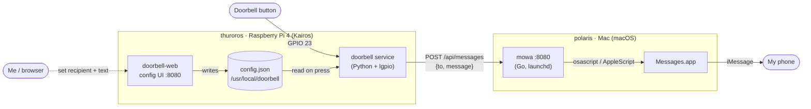

# Node architecture

How the homelab nodes interact with each other and with supporting services.
Each subsystem below spans more than one node; node-specific internals live in
that node's own README.

## Doorbell notifications

A Raspberry Pi 4 (`thuroros`) watches a physical doorbell button and relays
presses to [mowa](https://github.com/mauromorales/mowa) running on the Mac
(`polaris`), which delivers them to my phone over Apple Messages / iMessage.
`thuroros` has no notification capability of its own.

- **`thuroros`** — watches the button, holds the recipient/message config, and
  `POST`s to mowa. Internals: [nodes/thuroros](./thuroros/README.md).
- **`polaris` / mowa** — expands the target group (`admin` / `family`) to phone
  numbers and sends each via `osascript` → Messages.app → iMessage.

### Flow

1. The button is pressed → GPIO 23 goes low.
2. `doorbell` reads `{to, message}` from its config file.
3. It `POST`s to `http://polaris.local:8080/api/messages`.
4. mowa expands the group to phone number(s) and tells Messages.app to send.
5. Messages delivers over iMessage to my phone.

End to end this is typically **~0.4s**: GPIO detect ≤0.1s, mowa + AppleScript
~0.18s, iMessage delivery ~0.18s. Overall latency is bounded by iMessage, not by
this pipeline — the local hops are sub-second.

mowa relays *synchronously* through the Messages AppleScript bridge, which can
occasionally wedge (its default AppleEvent timeout is ~120s); the doorbell
guards against that with a request timeout (see its README).

### Discovery

Both hosts advertise on the LAN over mDNS (avahi / Bonjour), so `thuroros`
reaches mowa at `polaris.local` — no static IPs.

<!-- Add further cross-node subsystems here as the lab grows
     (e.g. the k8s cluster across protos/noos/kairos, shared storage, …). -->
