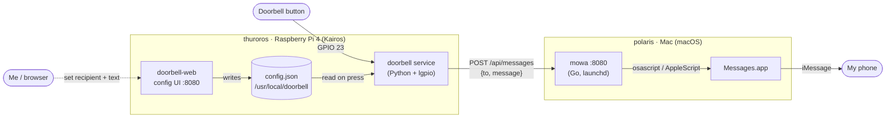

# ThurorOS

Special-purpose OS for the **doorbell relay**. A Raspberry Pi 4 (`thuroros`)
watches a physical doorbell button and, when it is pressed, notifies my phone.
The Pi has no notification capability of its own — it hands the message to
[mowa](https://github.com/mauromorales/mowa) running on the Mac (`polaris`),
which relays it through Apple Messages / iMessage.

## Architecture



Both hosts advertise on the LAN over mDNS (avahi / Bonjour), so `thuroros`
reaches mowa at `polaris.local` — no static IPs.

## The two nodes

### thuroros (this node)

A Kairos image (Ubuntu 22.04 base, `rpi4` model) that self-configures on first
boot from [`cloud-config.yaml`](./cloud-config.yaml). It runs two systemd
services:

- **`doorbell`** — a Python script (`lgpio`) that monitors GPIO pin 23. On a
  press it reads the current recipient and message from the config file and
  `POST`s them to mowa. It checks the per-recipient `results[].success` in
  mowa's response, and bounds the request with a `(3.05s, 10s)` timeout so a
  stuck relay can't freeze the button handler.
- **`doorbell-web`** — a tiny stdlib HTTP server on `:8080` serving a config
  page at `http://thuroros.local:8080/doorbell`. It lets me switch the recipient
  between the `admin` and `family` groups and change the message text without
  rebuilding the image.

Both share `/usr/local/doorbell/config.json` — a Kairos persistent path, so it
survives reboots and image upgrades. `doorbell-web` writes it; `doorbell` reads
it on every press.

### polaris (mowa)

A Mac running [mowa](https://github.com/mauromorales/mowa) as a `launchd`
service on `:8080`. It exposes `POST /api/messages` taking
`{"to": [<group-or-number>], "message": <text>}`. mowa expands group names to
phone numbers (its own config defines the `admin` and `family` groups) and sends
each via `osascript` → AppleScript → Messages.app → iMessage.

## Notification flow

1. The button is pressed → GPIO 23 goes low.
2. `doorbell` reads `{to, message}` from the config file.
3. It `POST`s to `http://polaris.local:8080/api/messages`.
4. mowa expands the group to phone number(s) and tells Messages.app to send.
5. Messages delivers over iMessage to my phone.

End to end this is typically **~0.4s**: GPIO detect ≤0.1s, mowa + AppleScript
~0.18s, iMessage delivery ~0.18s. Overall latency is bounded by iMessage, not by
this pipeline — the local hops are sub-second.

## Configuration

`/usr/local/doorbell/config.json`:

```json
{"to": "admin", "message": "🔔 Someone is at the door 🚪"}
```

- **`to`** — `admin` or `family` (must match a group defined in mowa).
- **`message`** — the notification text; defaults to the doorbell message.

Change either at `http://thuroros.local:8080/doorbell`.

## Operational notes

- **Resilience:** mowa relays *synchronously* through the Messages AppleScript
  bridge, which can occasionally wedge (its default AppleEvent timeout is
  ~120s). The doorbell's request timeout keeps such a wedge from freezing the
  button handler; it logs a timeout and keeps running.
- **Deployment:** changes to `cloud-config.yaml` trigger an image rebuild
  ([`build-thuroros.yaml`](../../.github/workflows/build-thuroros.yaml)); the
  new image is flashed or upgraded onto the Pi. Releases are cut by tagging
  (see [`release.yaml`](../../.github/workflows/release.yaml)).
