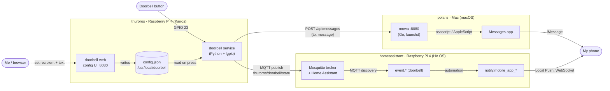

# ThurorOS

Special-purpose OS for the **doorbell relay**. A Raspberry Pi 4 (`thuroros`)
watches a physical doorbell button and, when it is pressed, notifies my phone.
The Pi has no notification capability of its own: it hands the message to
[mowa](https://github.com/mauromorales/mowa) running on the Mac (`polaris`),
which relays it through Apple Messages / iMessage, and it publishes the same
event to Home Assistant over MQTT (see below), for a local push notification
and a real entity with history.

## Architecture


```mermaid
flowchart LR
    button([Doorbell button]) -->|GPIO 23| doorbell
    me([Me / browser]) -.->|set recipient + text| webui

    subgraph thuroros["thuroros · Raspberry Pi 4 (Kairos)"]
        doorbell["doorbell service<br/>(Python + lgpio)"]
        webui["doorbell-web<br/>config UI :8080"]
        config[("config.json<br/>/usr/local/doorbell")]
        webui -->|writes| config
        config -->|read on press| doorbell
    end

    doorbell -->|"POST /api/messages<br/>{to, message}"| mowa
    doorbell -->|"MQTT publish<br/>thuroros/doorbell/state"| ha

    subgraph polaris["polaris · Mac (macOS)"]
        mowa["mowa :8080<br/>(Go, launchd)"]
        messages["Messages.app"]
        mowa -->|osascript / AppleScript| messages
    end

    subgraph haHost["homeassistant · Raspberry Pi 4 (HA OS)"]
        ha["Mosquitto broker<br/>+ Home Assistant"]
        entity["event.* (doorbell)"]
        ha -->|MQTT discovery| entity
        entity -->|automation| push["notify.mobile_app_*"]
    end

    messages -->|iMessage| phone([My phone])
    push -->|Local Push, WebSocket| phone
```

All three hosts advertise on the LAN over mDNS (avahi / Bonjour), so `thuroros`
reaches mowa at `polaris.local` and Home Assistant at `homeassistant.local`:
no static IPs.

## The two nodes

### thuroros (this node)

A Kairos image (Ubuntu 22.04 base, `rpi4` model) that self-configures on first
boot. [`cloud-config.yaml`](./cloud-config.yaml) holds what's genuinely
install-time/per-instance (hostname, users); everything else lives as
per-concern fragments under [`system-oem/`](./system-oem/), baked into
`/system/oem` at image build time (see "Cloud-config layout" below for why).
It runs two systemd services:

- **`doorbell`** — a Python script (`lgpio`) that monitors GPIO pin 23. On a
  press it reads the current recipient and message from the config file and
  `POST`s them to mowa. It checks the per-recipient `results[].success` in
  mowa's response, and bounds the request with a `(3.05s, 10s)` timeout so a
  stuck relay can't freeze the button handler. It also publishes the press to
  Home Assistant over MQTT (see below), independently: a broker outage cannot
  affect the iMessage path, and a Messages wedge cannot affect MQTT.
- **`doorbell-web`** — a tiny stdlib HTTP server on `:8080` serving a config
  page at `http://thuroros.local:8080/doorbell`. It lets me switch the recipient
  between the `admin` and `family` groups and change the message text without
  rebuilding the image.

Both share `/usr/local/doorbell/config.json` — a Kairos persistent path, so it
survives reboots and image upgrades. `doorbell-web` writes it; `doorbell` reads
it on every press.

### polaris (mowa)

A Mac running [mowa](https://github.com/mauromorales/mowa) as a `launchd`
service on `:8080`. It exposes `POST /api/messages` taking
`{"to": [<group-or-number>], "message": <text>}`. mowa expands group names to
phone numbers (its own config defines the `admin` and `family` groups) and sends
each via `osascript` → AppleScript → Messages.app → iMessage.

## Notification flow

1. The button is pressed → GPIO 23 goes low.
2. `doorbell` reads `{to, message}` from the config file.
3. It `POST`s to `http://polaris.local:8080/api/messages`.
4. mowa expands the group to phone number(s) and tells Messages.app to send.
5. Messages delivers over iMessage to my phone.

End to end this is typically **~0.4s**: GPIO detect ≤0.1s, mowa + AppleScript
~0.18s, iMessage delivery ~0.18s. Overall latency is bounded by iMessage, not by
this pipeline: the local hops are sub-second.

## Home Assistant (MQTT)

On every press, `doorbell` also publishes to the Mosquitto broker on the
`homeassistant` Pi, independently of the mowa/iMessage path above:

- **Once, retained, at service start**, a discovery message to
  `homeassistant/event/thuroros_doorbell/config`. Home Assistant reads this and
  creates the doorbell's `event.*` entity automatically: no manual entity setup
  on the HA side. (Exact `entity_id` is HA's to assign; check it once this is
  live rather than assuming the name here.)
- **On every press**, `{"event_type": "pressed", "message": <text>}` to
  `thuroros/doorbell/state`. Each press shows up in Home Assistant's Logbook and
  History like any other entity state change.

An HA automation triggers on that entity and calls `notify.mobile_app_*` for the
push. That automation lives in Home Assistant's own config, not in this
repository. Today it's set to **Local Push** only (WebSocket, free, works while
the phone is on the same Wi-Fi as Home Assistant); remote (away from home) push
would need Nabu Casa or a VPN back into the LAN, deliberately not set up yet.

**MQTT credentials, if the broker needs them, are never in this file.** They're
optional fields (`mqtt_user`, `mqtt_password`) in the same persisted
`config.json` described below, set through `doorbell-web`, never committed to
git. `homelab` is public. The file itself is `chmod 600`, root-only, since it
can hold a plaintext credential.

## Configuration

`/usr/local/doorbell/config.json`:

```json
{"to": "admin", "message": "🔔 Someone is at the door 🚪"}
```

- **`to`** — `admin` or `family` (must match a group defined in mowa).
- **`message`** — the notification text; defaults to the doorbell message. Also
  carried as an attribute on the Home Assistant event.
- **`mqtt_user`** / **`mqtt_password`** (optional): only needed if the Mosquitto
  broker requires authentication. Unset means an anonymous MQTT connection.

Everything above changes at `http://thuroros.local:8080/doorbell`. The password
field is never pre-filled with the current value, a blank submit leaves it
unchanged; clearing the username drops both fields together, since a password
with no username is meaningless.

## Operational notes

- **Resilience:** mowa relays *synchronously* through the Messages AppleScript
  bridge, which can occasionally wedge (its default AppleEvent timeout is
  ~120s). The doorbell's request timeout keeps such a wedge from freezing the
  button handler; it logs a timeout and keeps running. The MQTT publish has the
  same shape: a 5s socket timeout, caught and logged, never raised, so a broker
  outage cannot freeze the button handler either.
- **Deployment:** changes to `cloud-config.yaml` or `system-oem/` trigger an
  image rebuild
  ([`build-thuroros.yaml`](../../.github/workflows/build-thuroros.yaml)).
  `system-oem/` fragments reach an already-installed Pi via a plain
  `kairos-agent upgrade`, since they're baked into the image. `cloud-config.yaml`
  does not: it lands on `COS_OEM`, which is only written at install/reflash
  time (`kairos-agent upgrade` never touches it, mission-control#532) — a
  change there needs a reflash to actually reach an existing node. Releases
  are cut by tagging (see [`release.yaml`](../../.github/workflows/release.yaml)).

## Cloud-config layout

Two places, two different lifetimes, both read by `kairos-agent`
(`agent/pkg/constants/constants.go`'s `GetCloudInitPaths()`, checked
2026-08-30 against `kairos-io/kairos`):

- **`cloud-config.yaml`** → `COS_OEM` (`/oem`). Written once, at install or
  reflash. Use this only for what's genuinely per-instance and not expected
  to change without a reflash anyway (hostname, users).
- **`system-oem/*.yaml`** → `/system/oem`, baked into the image itself by
  [`kairos.Dockerfile`](./kairos.Dockerfile)'s `COPY` step. Refreshes on
  every `kairos-agent upgrade`, no reflash needed. Use this for everything
  else — services, scripts, certs, anything that should actually take effect
  the next time the node upgrades.

**Naming: always a letter prefix (`z_...`), never a number.** `kairos-init`
ships its own bundled fragments in the same `/system/oem` directory, strictly
two-digit-numeric-named (`00_rootfs.yaml` ... `52_installer.yaml` as of
2026-08-30 — already past the `50s`, which is why a reserved numeric range
doesn't work). Every file in the directory merges in plain lexical order
(`kairos-sdk/collector`, `filepath.Walk`), and ASCII digits sort before ASCII
letters, so a letter-prefixed file sorts after anything `kairos-init` could
ever add, with no range to reserve or renegotiate on every version bump.
